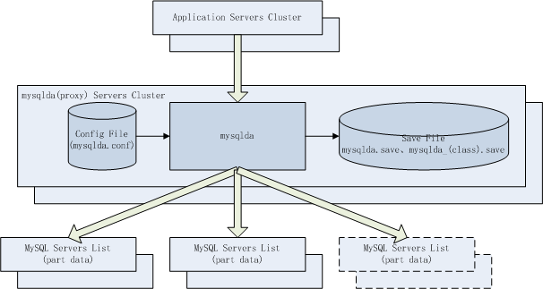

mysqlda - MySQL数据库中间件
==========================

<!-- TOC -->

- [1. 概述](#1-概述)
    - [1.1. 数据分布式切分方式](#11-数据分布式切分方式)
    - [1.2. mysqlda](#12-mysqlda)
- [2. 架构与原理](#2-架构与原理)
    - [2.1. 体系架构](#21-体系架构)
    - [2.2. 工作原理](#22-工作原理)
    - [2.3. 内部数据实体和关系](#23-内部数据实体和关系)
- [3. 安装部署](#3-安装部署)
- [4. 配置使用](#4-配置使用)
- [5. 最后](#5-最后)
    - [5.1. 后续研发](#51-后续研发)
    - [5.2. 源码托管](#52-源码托管)
    - [5.3. 作者邮箱](#53-作者邮箱)

<!-- /TOC -->

# 1. 概述

## 1.1. 数据分布式切分方式

分布式架构中最难解决的是数据分布式问题，大部分数据库中间件都**以分库分表作为切分方式**，好处是通用，但也存在以下问题：

1. 扩容过程需要以切片为单位在库间移动数据。扩容规模受到切片数量限制，如果业务发展增长规模大大超出初期预估会导致切片数量不够用，陷入数据硬迁移的困境。
2. 同一业务对象的数据分散在不同库中，无法做聚合、连接等复杂处理。
3. 跨库意味着分布式事务，虽然现在有两阶段提交等解决方案，但理论上并不总是那么可靠，尤其是在金融行业苛求数据强一致性。

**以核心业务对象切分方式**则以产品线入口业务对象作为切分目标（比如互联网业务系统中的客户对象），开户交易途径数据库中间件，以手机号或其它入口字段作为核心字段做附带权重的客群切分，归属到数据库集群中的某个库中，并保存分配结果，以后该客户的所有交易都会被发往其归属库处理。当需要库存储扩容时，只需简单的增加库到数据库集群中，在数据库中间件系统中增加新库配置信息，并调大新库被分配权重，新客户分配归属到新库的概率变大，当新库存储增长到一定程度时调平分配权重，新客户分配归属到所有库的概率均等，直到下一次扩容。

以核心业务对象切分方式的好处是：

1. 无需预估切片，其扩容过程无需移动任何数据。
2. 由于同一业务对象的数据集中在其归属库中，所以可以进行任意聚合、连接等复杂处理。
3. 每个库都是全业务库，同一业务对象的所有模块处理都在一个库中完成，不存在跨库分布式事务，数据强一致性丢还给数据库单库来保证。

但也存在以下硬伤：

1. 产品线设计初期慎重挑选核心业务对象作为切分依据，后期将很难变更。
2. 有些业务系统存在多个核心业务对象，不适合使用这种切分方式，如银行线上线下整合核心。

**以分库分表切分**和**以核心业务对象切分**是两种主流的数据分布式设计范式，各有优缺点，应在不同场景挑选合适的方式。

## 1.2. mysqlda

mysqlda是一款基于核心业务对象切分的Proxy模式的MySQL数据库中间件。

mysqlda优势：

* 以核心业务对象切分方式的所有好处。
* 单体系统的数据分布式改造过程尽量无感
* 支持以核心业务对象查询分配库（如开户用手机号或邮箱），也支持核心业务对象的关联对象（如开户后的用户ID、用户名、账号）查询MySQL归属库。
* 归属库分配权重自动调整，扩容后新库与老库的分配权重也自动调整，无需人工介入，使得所有库的数据量尽量自动均衡增长。
* 核心业务对象切分的库支持MySQL服务器优先列表，提高系统可用性。
* 与MySQL服务器之间连接池机制实现连接复用和闲置清理，提高连接和切换效率。
* 通过在线重载配置文件，扩容调整MySQL服务器优先列表、新增MySQL归属库完全无感。

# 2. 架构与原理

## 2.1. 体系架构

mysqlda数据库中间件完全遵循MySQL通讯协议桥接应用服务器集群和MySQL数据库集群。

## 2.2. 工作原理

MySQL数据库集群预创建相同的连接用户名、密码，相同的数据库名和应用表结构，mysqlda预创建相同的连接用户名、密码。

启动mysqlda集群，从配置文件（etc/mysqlda.conf）中装载连接用户名、密码，从保存文件（etc/mysqlda.save、etc/mysqlda.关联对象类.save）中装载已存在的核心业务对象、关联对象 与 MySQL数据库集群库 归属库关系信息。

应用服务器调用标准MySQL连接函数/方法连接mysqlda，mysqlda会遵循MySQL通讯协议处理MySQL用户登录和密码校验。

登录成功后，所有DML操作前，应用服务器调用mysqlda提供的定制函数/方法发送**核心业务对象**（forward\_library）或**关联对象类**（forward\_correl\_object\_class）、**关联对象**（forward\_correl\_object），mysqlda会查询其已分配的MySQL库**核心业务对象**（forward\_library）或**关联对象类**（forward\_correl\_object\_class）、**关联对象**（forward\_correl\_object）（如果没有分配过则根据加权一致性哈希算法分配一个归属库并持久化到保存文件中），从该MySQL归属库对应数据库服务器有序列表（forward\_servers list）中选择一个服务器及其连接池（unused\_forward\_session list）中选取空闲连接（如没有缓存连接则新建一条连接），然后桥接对外（accepted\_session）和对内（forward\_session）连接结对，开始处理后续所有DML操作。

后续DML操作中可以也调用mysqlda提供的函数/方法发送**核心业务对象**或**关联对象类、关联对象**改变与新的MySQL归属库服务器连接。

MySQL归属库对应一个数据库服务器列表，如由MySQL数据库1A(MASTER)、1B(SLAVE)、1C(SLAVE)、1D(SLAVE)组成，1A同步复制数据给1B、1C和1D，如果1A出现故障不能被mysqlda连接，mysqlda会依次尝试连接1B、1C和1D，实现系统可用性。

应用服务器调用mysqlda提供的定制函数/方法发送**关联对象类**（forward\_correl\_object\_class）、**关联对象**（forward\_correl\_object）和**核心业务对象**的设置关系接口给mysqlda，mysqlda会保存该关系并持久化到保存文件中，供以后直接用**关联对象类**（forward\_correl\_object\_class）、**关联对象**（forward\_correl\_object）定位MySQL归属库。

## 2.3. 内部数据实体和关系

一个**核心业务对象**（forward\_library）可以对应多个**关联对象类**（forward\_correl\_object\_class）、**关联对象**（forward\_correl\_object）。

一个**核心业务对象**或一个**关联对象类、关联对象**对应一个**MySQL归属库**（forward\_library），一个**MySQL归属库**对应一个**MySQL数据库服务器有序列表**（forward\_servers list），一个**MySQL数据库服务器有序列表**（forward\_servers list）下辖一个**空闲连接池**（unused\_forward\_session list）和一个**工作连接池**（forward\_session list）。

accepted\_session是mysqlda与应用服务器之间的通讯会话，forward\_session是mysqlda与MySQL数据库服务器之间的通讯会话，一旦一条连接上的MySQL归属库被选定或切换，这两个会话会被桥接起来。

# 3. 安装部署

# 4. 配置使用

# 5. 最后

## 5.1. 后续研发

* 增加JAVA支持。现在只支持C连接
* 实现mysqlda服务器集群。现在只支持mysqlda单服务器
* 更多功能、更少性能衰减

## 5.2. 源码托管

* [开源中国](http://git.oschina.net/calvinwilliams/mysqlda)
* [github](https://github.com/calvinwilliams/mysqlda/)

## 5.3. 作者邮箱

* [网易](mailto:calvinwilliams@163.com)
